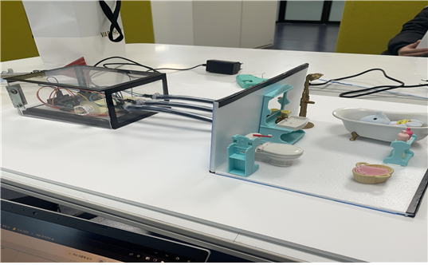
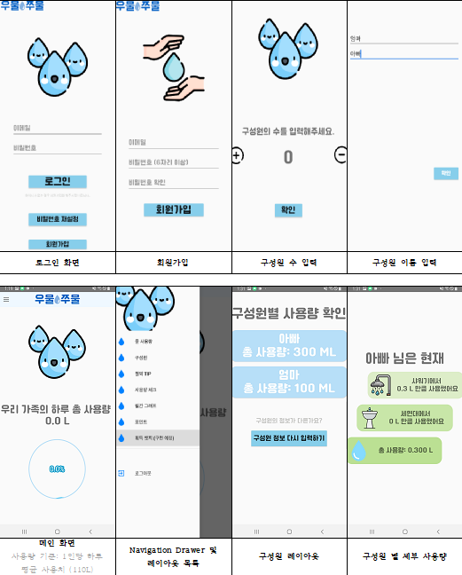
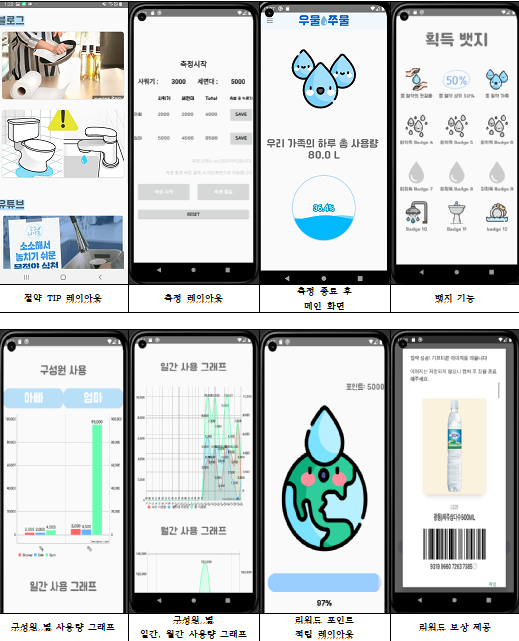

# 1. 개요

## 1.1 개발동기 및 프로젝트 개요
2021년 10월 5일 세계기상기구(WMO)의 보고서에 따르면 ‘2018년 36억 명의 사람들이 적어도 1년에 한 달 동안 물을 제대로 이용하지 못했다. 2050년까지, 물 부족에 시달릴 사람은 50억 명 이상으로 증가할 것으로 예상된다.’라고 보고하였다. 또한, 전 세계적으로 탄소를 줄이는 ‘탄소중립’ 정책이 우선시 되고 있다. 물은 생산과 공급, 하수 처리를 위해 에너지를 사용하고 그 과정에서 온실가스가 발생한다. 국가 온실 가스 배출 계수 기준, 물 1L 사용 당 0.332g의 온실가스를 배출한다. 1년에 대략 한 사람이 사용하는 물은 100,500L로 약 35kg의 온실가스를 배출하는 셈이다. 이외에도 전 세계적으로 물 부족 현상을 겪고 있는 와중, 올해 초 대한민국에서도 전남권에서 물 부족 문제가 대두되었다. 정부에서는 제한급수의 시점을 늦추기 위해 시민들에게 물의 중요성을 알리고 가정집에서 개인의 물 사용 절약을 강조하는 캠페인을 주기적으로 시행하였으나, 시민들은 정부가 권하는 절약 방법들을 시행하여도 수도세 요금을 확인하는 방법 이외에는 자신이 어느 정도의 물을 사용하고 절약했는지 주기적으로 확인하기 어려우며 다인 가구의 경우 구성원간 물 사용량을 구분할 수 없다. 이러한 불편함을 해소하기 위해 구성원간 일간 물 사용량을 측정하고 기록할 수 있는 애플리케이션을 만드는 것을 목표로 한다.

## 1.2 구현 목표 

[HW] 
 아두이노 키트와 유량 측정 센서(YF-S201)를 사용하여 세면대, 샤워기, 싱크대에 설치한 후, 각각의 유량을 측정하고 WiFi(ESP8266)를 통해 애플리케이션으로 전송하는 것을 목표로 한다. 측정 편의성을 고려하여 화장실 입구 쪽에 PIR센서(HC-SR50)을 이용하여 사용자의 화장실 출입을 감지한 다음, 유속측정기를 자동으로 On/Off 할 수 있도록 설계한다.  

[SW]
 각 구성원별 세면대, 샤워기의 물 사용량에 대한 실시간 물 사용량, 월간 사용량을 비롯하여 그래프와 같은 시각적인 통계자료를 제공한다. 이를 통하여 사용자들은 현재 자신이 사용한 물의 양과 추세를 파악할 수 있다. 당근마켓과 유사한 뱃지 기능 및 기프티콘을 사용자에게 제공하여 물 절약에 대한 보상을 통해 사용자들이 적극적으로 물 절약에 참여할 수 있도록 도움을 준다. 

## 1.3 기대 효과

(1) 사용자 물 사용량 패턴 분석
  사용자의 물 사용 데이터를 통해 제공되는 정보는 사용자들이 자신의 물 소비 패턴을 분석하는 데 큰 도움을 줄 수 있다. 이를 통해 불필요한 물 사용량을 인식하게 하고 개선할 수 있다. 예를 들어, 사용자는 특정 시간대에 많은 양의 물을 사용하거나 특정 기기에서 물을 비효율적으로 사용할 가능성이 있다. 이 애플리케이션을 통해 사용자는 절약 가능한 영역을 식별하고 더 효율적인 물 사용 습관을 형성할 수 있을 것이다.

 (2) 경제적, 환경 보호 효과 
  사용자가 자신의 물 소비를 감시하고 관리함으로써, 물 사용량이 줄어들어 수도세가 절감될 수 있으며, 상수도 설비에서 발생 되는 탄소 배출량을 감소시킨다. 물 공급 및 처리를 위한 에너지 소비를 줄이는 것은 환경 보호에 기여 하는 중요한 요소이다. 따라서, 이 애플리케이션을 통해 사용자들은 개인적인 물 절약 노력을 통해 경제적인 이점을 얻을 수 있을 뿐만 아니라, 환경 보호에도 기여 하는 긍정적인 효과를 기대할 수 있다.

 (3) 누수 탐지 
 가정집의 실시간 물 사용량을 관리할 수 있는 전체적인 서버를 구축한다면 물을 사용하지 않았음에도 불구하고 사용량이 확인된다면 누수가 발생하고 있는지를 인지할 수 있고 누수가 진행되고 있는 부분을 보다 효과적으로 확인할 수 있다. 

 (4) 고독사 예방   
 최근 대한민국은 노인 이외에도 1인 가구 청년들이 많아지면서 최근 5년간 고독사 추이가 증가하고 있는 추세이다. 
  
 “고독사 5년새 40% 증가…50대 가장 취약”(CBS노컷뉴스 김소영 기자, https://www.nocutnews.co.kr/news/5946691)
이를 사전에 방지하기 위해 서버에서 실시간으로 물 사용량을 확인하여 일정 시간 이상 물 사용량이 확인되지 않는다면 연결된 가족에게 알람이 갈 수 있도록 확인할 수 있도록 도움을 준다.

## 1.4 참여 구성원 및 수행 역할

| 참여구성원 | 수행역할 |
|------------|------------------------------------------------------------|
| 정규현     | 진행 계획 관리 및 애플리케이션 설계, 아두이노 코딩, HW 설계, 모델링 제작 |
| 정금열     | 애플리케이션 설계, 아두이노 코딩, HW 설계                |
| 김승원     | ESP8266 WiFi 설계, 모델링 및 PPT 제작                    |
| 권남진     | ESP8266 WiFi 설계 및 모델링 제작                          |

## 2. 개발 환경

### HW
  1. Arduino Uno R3
  2. YF-S201(유량 측정 센서) 
  3. ESP-8266(WiFi 모듈)
  4. PIR센서(HC-SR50) 

### SW
  1. Android Studio (2021.03 ver)
      - Min SDK Version: API 28 Android 9.0 (Pie)
      - Target SDK Version: API 32 Android 12L (Sv2)
      - Android Virtual Device: Pixel 5 API 29  
      - Physical Device: samsung SM-N950N (갤럭시 노트8)

  2. Arduino IDE (2.1.0 ver) 
     [포함된 라이브러리]
      -  ESP8266 – 2.5.0 ver
      - arduinojson – 5.13.5 ver
      - FirebaseArduino – 0.3 ver

  3. Firebase Realtime Database, Firebase Storage

### 3. 결과

